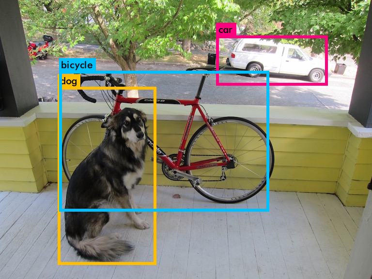

# Darknet

Darknet is an open source neural network framework written in C and CUDA. It is fast, easy to install, and supports CPU and GPU computation.

For more information see the [Darknet project website](http://pjreddie.com/darknet).

For questions or issues please use the [Google Group](https://groups.google.com/forum/#!forum/darknet).

## Usage

```bash
git clone https://github.com/pjreddie/darknet.git
cd darknet

make GPU=1 CUDNN=0 -j
wget https://pjreddie.com/media/files/yolo-voc.weights

./darknet detector test cfg/voc.data cfg/yolo-voc.cfg yolo-voc.weights data/dog.jpg
```

**Result**


